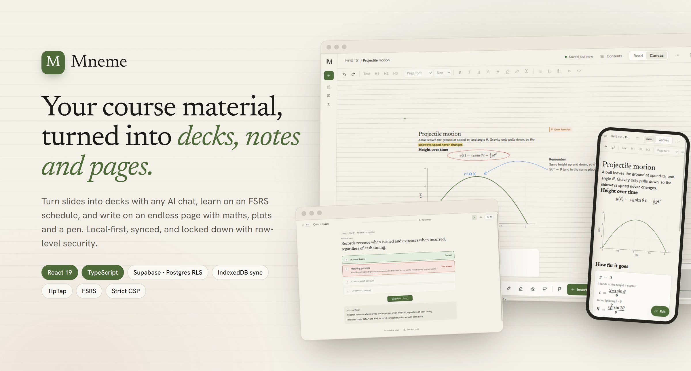
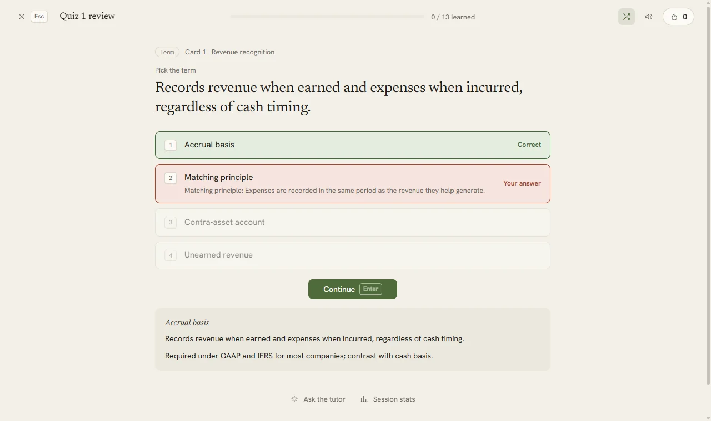
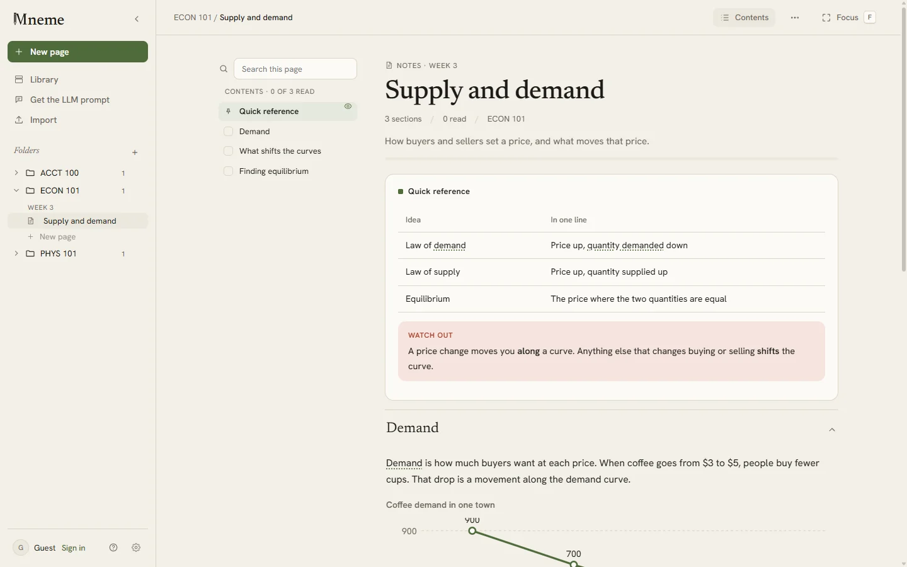
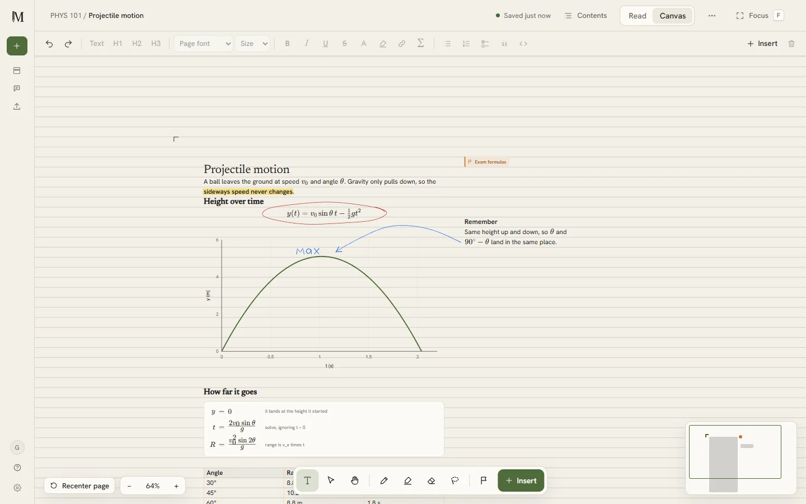
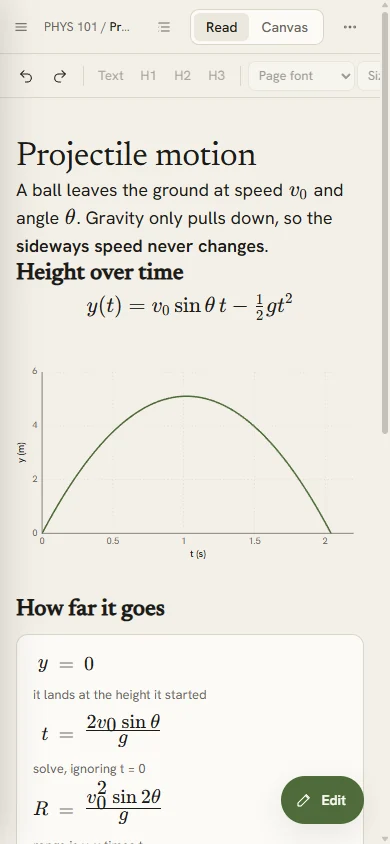
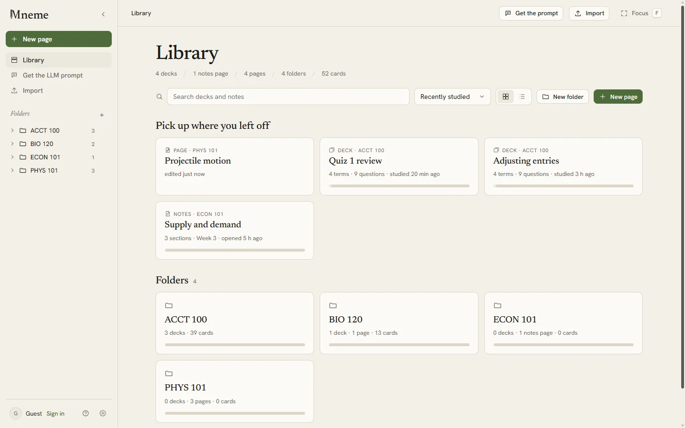
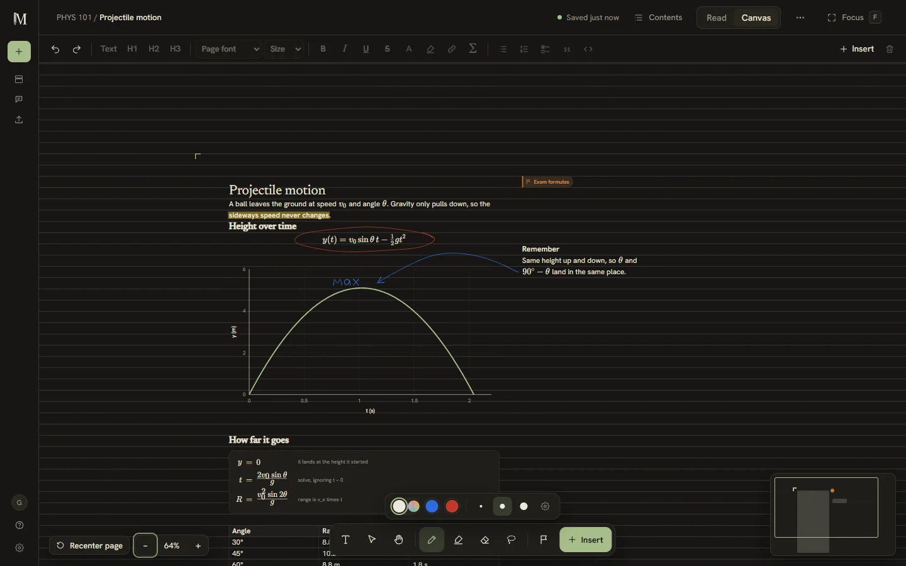
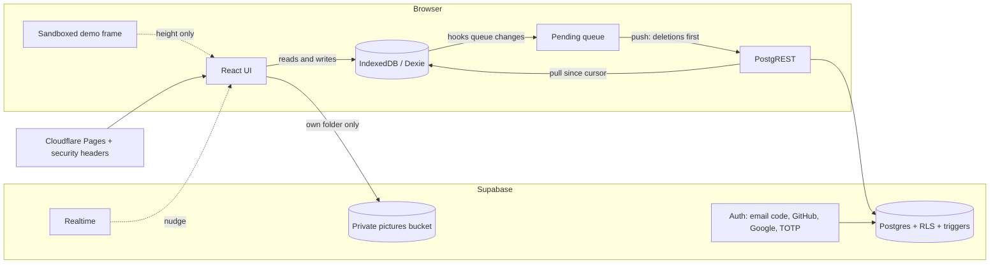

<p align="center">
  
</p>

<h1 align="center">Mneme</h1>

<p align="center">
  <b>Your course material, turned into decks, notes and pages.</b><br>
  A local-first study app: spaced-repetition decks made with any AI chat, readable notes, and an endless writing canvas with maths, plots and a pen.
</p>

<p align="center">
  <a href="https://mnemee.pages.dev">Open the app</a> ·
  <a href="https://mnemee.pages.dev/about">Introduction</a> ·
  <a href="https://mnemee.pages.dev/docs">Docs</a> ·
  <a href="SECURITY.md">Security</a>
</p>

<p align="center">
  <a href="https://github.com/shreywy/Mneme/actions/workflows/ci.yml"></a>
  <a href="https://github.com/shreywy/Mneme/actions/workflows/codeql.yml"></a>
  <a href="https://scorecard.dev/viewer/?uri=github.com/shreywy/Mneme"></a>
  
  
  
  
</p>

<p align="center">
  <a href="https://mnemee.pages.dev"></a><br>
  <sub>Live from the app's database, refreshed every 30 minutes. Guest use stays on people's devices and isn't counted.</sub>
</p>

---

## What it does

Mneme is a study app for the courses you're actually taking. It has three kinds of page, and they live in the same folders.

| | |
|---|---|
| **Decks.** Mneme writes a prompt; you paste it into ChatGPT, Claude or Gemini with your slides, and import the deck it sends back. No API key needed. **Learn** is an endless queue scheduled with FSRS (the model Anki uses). Misses come back within a few cards; right answers come back later and harder. Flashcards, timed Tests and Match rounds too. |  |
| **Notes.** The same prompt writes readable notes. They have contents and chapters, and key terms explain themselves on hover. Derivations line up on the equals sign, plots are drawn from formulas, and there are questions to check yourself. Highlight, annotate and bookmark, then pack any mix of notes and decks into a 2, 3 or 4-column cheat sheet. |  |
| **Pages.** An endless sheet of paper for your own writing, on one grid so side-by-side blocks share their lines. You get equations typed with a maths keyboard, step-by-step working, plots, tables, highlighted code and pictures. There's also a pen with pressure, a highlighter that sits behind the text, an eraser that rubs out part of a stroke, a lasso, and shapes that snap to the grid. Lay it out on A4 or Letter and save it as a PDF. |  |
| **Everywhere.** Everything is stored in the browser first, so it's instant and works offline. Sign in (emailed code, GitHub or Google) and it syncs to your other devices within seconds. Share any deck, notes page or page as a read-only link. |  |

<p align="center">
  
  
</p>

## Engineering highlights

- **Local-first sync engine** ([`src/sync/engine.ts`](src/sync/engine.ts))
  - The UI only ever talks to IndexedDB (Dexie). Hooks queue every create, update and delete.
  - A push sends rows, or tombstones, deletions first. A pull reads per-table cursors with an overlap window, so rows committed out of order aren't missed.
  - Unpushed local changes win, and Realtime nudges trigger pulls.
  - It keeps working when the client ships ahead of a database migration, by skipping and queueing tables the server doesn't have yet.
  - Covered by tests against an in-memory server.
- **Multi-tenant Postgres with row-level security on every table.**
  - Policies are forced and owner-only.
  - A SQL test suite ([`supabase/tests/rls.sql`](supabase/tests/rls.sql)) signs in as two users and tries to read, change, delete and forge each other's rows across every table.
  - Shares are reachable only through a `security definer` function and 144-bit ids.
  - Account deletion is gated in SQL on an emailed code from the last ten minutes.
- **A storage quota enforced in the database.** Triggers count every synced row and share per account and reject writes past 20 MB, while deletions always succeed. The client sends deletions first, so a full account can always recover. Pictures get their own 50 MB, checked by the upload policy.
- **A canvas editor built on ProseMirror (TipTap 3).**
  - Custom nodes:
    - equations (MathLive, lazy-loaded)
    - derivations
    - function plots read by a safe expression parser
    - pictures
    - link cards
  - A grid-snapped infinite canvas with one undo history across blocks and ink.
  - Drags render locally and commit once, so moving hundreds of blocks stays smooth.
  - Pagination is done with editor decorations, so page-break spacing is never saved.
- **An ink engine** ([`src/sheets/ink.ts`](src/sheets/ink.ts))
  - perfect-freehand outlines; points quantised to 0.25 px and delta-encoded as small integers.
  - Hold-to-shape recognition from fill ratio and roundness (line, rectangle, ellipse, triangle).
  - Partial erasing by resampling and splitting strokes.
  - Lasso hit-testing.
  - Strokes anchored to the blocks they're drawn on.
  - Palm rejection and two-finger-tap undo.
- **A forgiving importer for LLM output.** A repair pass fixes the usual slips and reports each fix, then strict zod validation shows errors at their JSON path. The prompt's own example deck and notes are imported by the test suite on every run, so the prompt can't drift from the parser.

## Security

Everything an AI or another person writes is treated as hostile, and nothing is trusted to the browser. The full threat model is in [SECURITY.md](SECURITY.md).

**Data isolation, enforced in Postgres**
- Forced row-level security on every table and storage bucket, owner-only. A SQL suite ([`supabase/tests/rls.sql`](supabase/tests/rls.sql)) signs in as two users and attacks each other's rows, files, sessions and activity.
- Pictures live in a private bucket under the same per-user rules, with no overwrite policy. Shared pages get signed links that expire.
- Share links: 144-bit ids, readable one at a time through a `security definer` function, and rate-limited to 30 publishes an hour in a trigger.

**Account protection**
- **Two-step sign-in** (TOTP authenticator apps). Once enabled, a restrictive policy on every table, bucket and account function refuses any session below `aal2`, so a stolen email code or OAuth login reads nothing. The client pauses sync and asks for the code.
- **Signed-in devices**: every session with its browser, last activity and IP. Sign one out (its refresh tokens are deleted) or all others.
- **Activity log** of share links and signed-out devices, written only by the database and read-only to its owner.
- Account deletion needs an emailed code from the last ten minutes, checked in SQL.

**Content that can't run**
- **Content Security Policy** with `script-src 'self'` (no inline scripts, no eval), `frame-ancestors 'none'`, and `connect-src` limited to Supabase and the Gemini API. Also sent: HSTS, `nosniff`, a strict referrer policy and a locked-down permissions policy ([`public/_headers`](public/_headers)).
- **Sandboxed demos.** Interactive card demos run in an opaque-origin `sandbox` frame that loads [`demo-frame.html`](public/demo-frame.html), which has its own `default-src 'none'` policy.
- **No HTML from content.** Markdown without raw HTML, KaTeX with `trust: false`, SVG rebuilt as React elements from an allowlist, formulas read by a parser that never reaches `eval`.
- **Shared pages are checked against a schema**: hex-only colours (they end up in CSS), pictures only from Mneme's own signed links, and non-web links dropped by the editor.

**Tested like an attacker**
- An [XSS suite](src/content/xss.test.ts) of 35 known payloads against every place text becomes markup, plus a hostile shared page rendered through the real editor.
- [Property-based fuzzing](src/fuzz.test.ts) (fast-check) of the importers, the share-payload check, the formula parser and the SVG sanitiser with random, mutated and truncated input.
- [Browser tests](e2e/security.spec.ts) (Playwright, in CI) against the production build under its real headers. One imports a demo that tries to read storage, IndexedDB, cookies and the parent page, phone home, navigate and open popups, and every attempt must fail.

**Supply chain**
- Every GitHub Action pinned to a commit SHA, credential-free checkouts, least-privilege tokens.
- `npm audit` gate (0 known vulnerabilities), gitleaks across the whole git history, a bundle scan for keys that must never ship.
- CodeQL (`security-extended`), OpenSSF Scorecard, Dependabot, and a [`security.txt`](public/.well-known/security.txt) (RFC 9116).

## Architecture



Every synced table has the same shape on the server, `(user_id, id, doc jsonb, deleted, updated_at)`, so a new kind of data needs one migration and one line in the sync engine. Pages store each block and each pen stroke as its own row, so two devices editing different parts of a page never collide.

## Tech stack

| | |
|---|---|
| App | React 19, TypeScript (strict), Vite, React Router, Zustand |
| Data | Dexie (IndexedDB), zod, Supabase (Postgres, Auth with PKCE, Realtime, Storage) |
| Editor | TipTap 3 / ProseMirror, KaTeX, MathLive, lowlight (highlight.js), perfect-freehand |
| Learning | ts-fsrs |
| Hosting | Cloudflare Pages, GitHub Actions |
| Testing | Vitest (376 tests across 46 files, fake-indexeddb, an in-memory sync server), fast-check, Playwright, SQL RLS tests |
| Security tooling | CodeQL, OpenSSF Scorecard, gitleaks, npm audit, Dependabot |

## Running it locally

```bash
git clone https://github.com/shreywy/Mneme.git
cd Mneme
npm ci
cp .env.example .env.local   # optional: Supabase URL and publishable key for accounts and sync
npm run dev
```

Without Supabase settings it runs fully in guest mode: everything works, stored in the browser.

| Command | |
|---|---|
| `npm test` | Unit, data, XSS and property-based tests |
| `npm run test:e2e` | Browser security tests against `dist/` with the real headers (run `npx vite build` first) |
| `npm run typecheck` | TypeScript, strict |
| `npm run build` | Production build |
| `npm run test:db` | Row-level security tests against the linked Supabase project (rolled back) |
| `npx supabase db push` | Apply migrations |

## Project layout

```
src/
  app/           shell, routes, sidebar
  features/      library, deck, learn, flashcards, test, notes, sheet (Pages), share, site (intro + docs), account, settings
  engine/        FSRS adapter, Learn queue, grading (fuzzy, numeric, cloze)
  deck-format/   deck schema, parser and repair pass
  notes-format/  notes schema, parser, cheat sheets
  sheets/        canvas maths: grid, ink, pagination, paste detection, share payloads
  sync/          sync engine, accounts, shares
  content/       Markdown, sanitised SVG, sandboxed demos
supabase/
  migrations/    one SQL file per change
  tests/         row-level security tests
e2e/             browser security tests (Playwright)
deck-format/     the LLM prompts, each with a complete example the tests import
```

## What's next

- **AI with your own key.** A Gemini tutor on any card, "why is this wrong?", grading of typed answers, and lasso part of a page to ask about it. The key will be stored encrypted in the browser and sent only to Google.
- **Handwriting to text,** and drawn maths to LaTeX.
- **End-to-end encrypted decks:** AES-GCM with a key derived from a passphrase.
- **An offline desktop app.**

## License

[MIT](LICENSE) © Shrey Mistry
